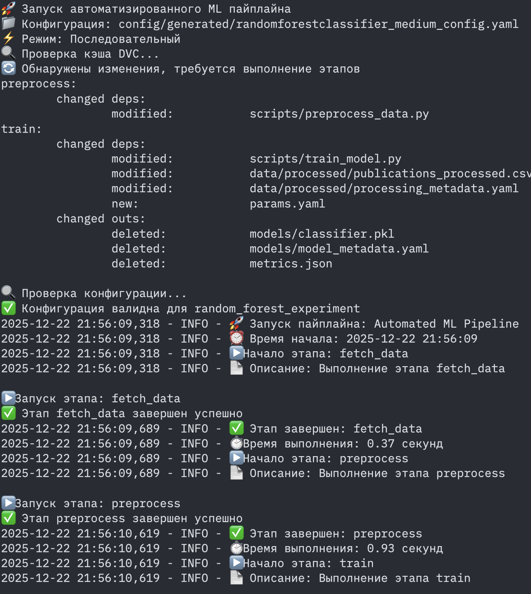
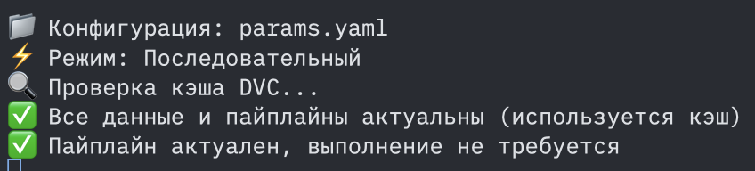

# ДЗ 4: Автоматизация ML пайплайнов

## 🎯 Выбранные инструменты

**Оркестрация пайплайнов:** DVC Pipelines  
**Управление конфигурациями:** Pydantic

## 📋 Что реализовано

✅ **Настройка DVC Pipelines:**
- Автоматизированный пайплайн из 3 этапов: `fetch_data` → `preprocess` → `train`
- Кэширование результатов (повторные запуски за секунды)
- Параллельное выполнение независимых этапов
- Декларативное описание зависимостей в `dvc.yaml`

✅ **Настройка Pydantic :**
- Строгая валидация всех параметров конфигурации
- Автоматическая генерация конфигураций для 3 алгоритмов (RandomForest, SVM, LogisticRegression)
- Система композиции конфигураций для разных размеров данных
- 6 готовых конфигураций в `config/generated/`

✅ **Интеграция и тестирование:**
- Единый автоматизированный скрипт `automated_pipeline.py`
- Система мониторинга с детальным логированием
- Уведомления о результатах выполнения
- Полная воспроизводимость результатов

## 🚀 Быстрый 

```bash
# 1. Переход в проект
cd research_agets_hub

# 2. Установка зависимостей (если нужно)
poetry install

# 3. Запуск автоматизированного пайплайна
poetry run python scripts/automated_pipeline.py

# 4. Проверка кэширования 
poetry run python scripts/automated_pipeline.py
```

**Ожидаемый результат:** 
- Первый запуск: ~8 секунд
- Повторный запуск: "✅ Пайплайн актуален, выполнение не требуется"

## 🔧 Демонстрация возможностей

### 1. Параллельное выполнение
```bash
poetry run python scripts/automated_pipeline.py --parallel --force
```

### 2. Разные конфигурации алгоритмов
```bash
# RandomForest
poetry run python scripts/automated_pipeline.py --config config/generated/randomforestclassifier_medium_config.yaml --force

# SVM
poetry run python scripts/automated_pipeline.py --config config/generated/svm_small_config.yaml --force

# LogisticRegression  
poetry run python scripts/automated_pipeline.py --config config/generated/logisticregression_medium_config.yaml --force
```

### 3. Проверка валидации конфигураций
```bash
poetry run python config/simple_composer.py
```

## 📊 Результаты и артефакты

После выполнения созданы:
- `reports/pipeline_execution_report.yaml` - детальный отчет выполнения
- `reports/notifications.log` - уведомления о результатах  
- `pipeline.log` - полные логи с временными метками
- `metrics.json` - метрики модели
- `models/classifier.pkl` - обученная модель

## 🔍 Структура автоматизации

### DVC Pipeline (`dvc.yaml`)
```yaml
stages:
  fetch_data:    # Получение данных из ArXiv
  preprocess:    # Предобработка данных  
  train:         # Обучение модели
```

### Pydantic конфигурации (`config/`)
- `pipeline_config.py` - модели валидации
- `simple_composer.py` - система композиции
- `generated/` - готовые конфигурации для 3 алгоритмов

### Автоматизация (`scripts/automated_pipeline.py`)
- Валидация конфигураций через Pydantic
- Запуск DVC этапов с мониторингом
- Параллельное/последовательное выполнение
- Система уведомлений


## 🎬 Демонстрация кэширования

```bash
# Первый запуск - выполняются все этапы
poetry run python scripts/automated_pipeline.py --force
# Результат: "🎉 Пайплайн выполнен успешно! (8.50 секунд)"

# Второй запуск - используется кэш
poetry run python scripts/automated_pipeline.py  
# Результат: "✅ Пайплайн актуален, выполнение не требуется"
```

## 📈 Мониторинг и логирование

Система создает подробные логи:
- **Консольные логи**: Прогресс с эмодзи и цветами
- **Файл логов**: `pipeline.log` с временными метками  
- **YAML отчет**: `reports/pipeline_execution_report.yaml`
- **Уведомления**: `reports/notifications.log`


---
