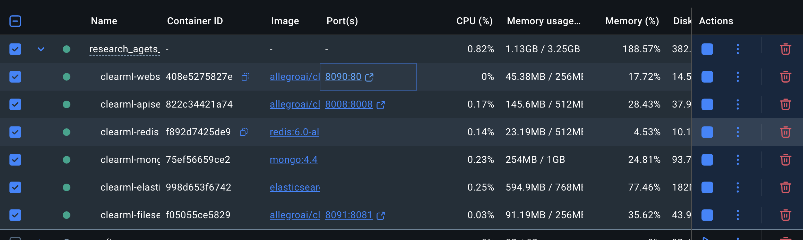
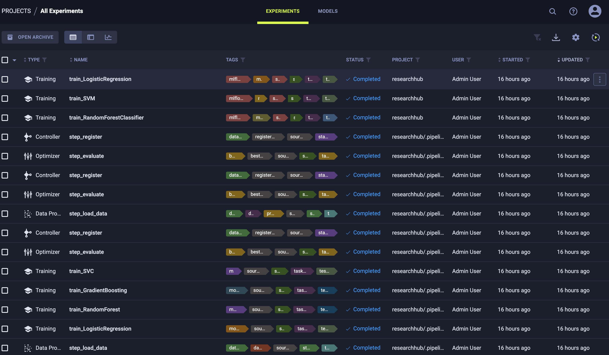
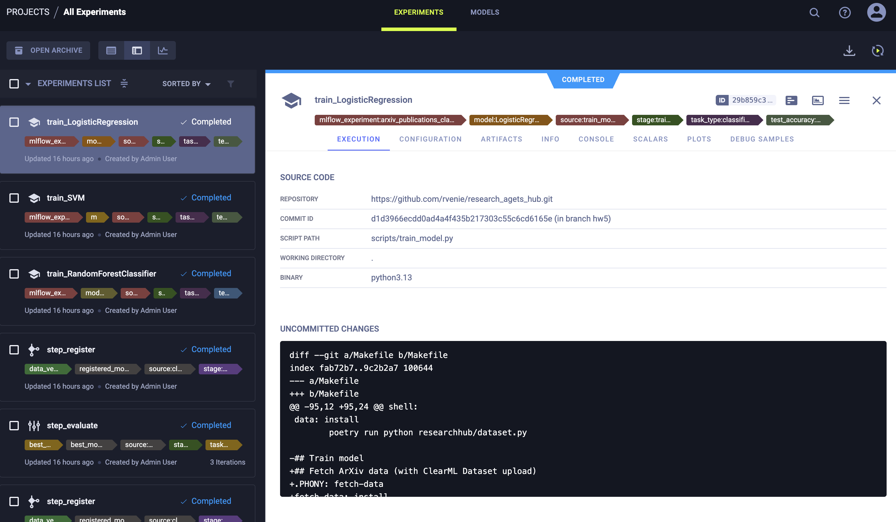
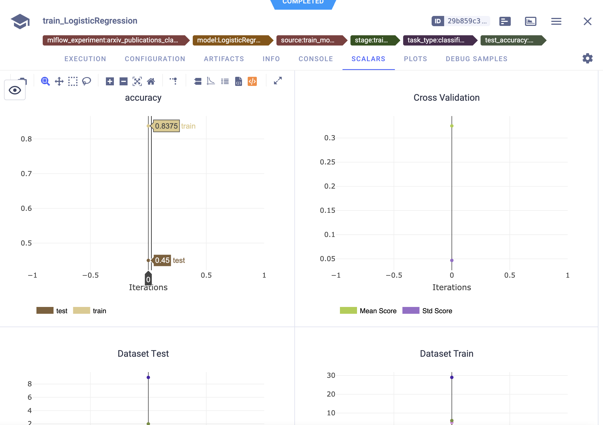
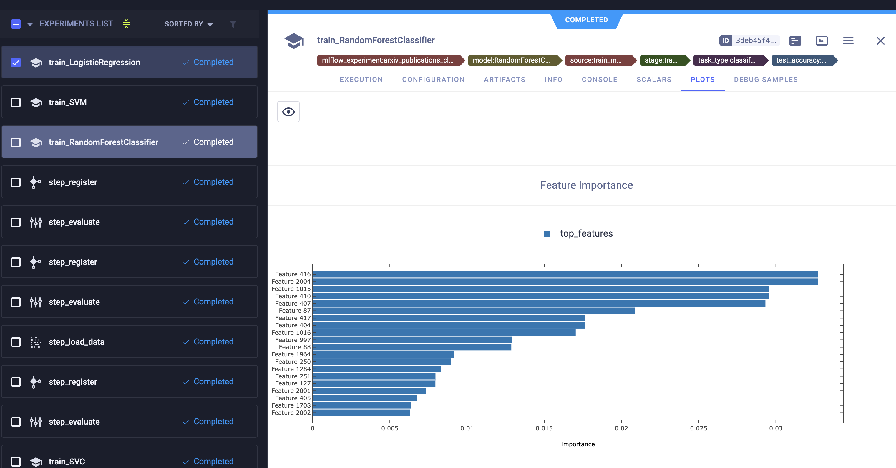
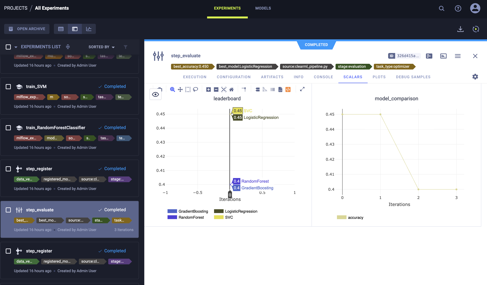
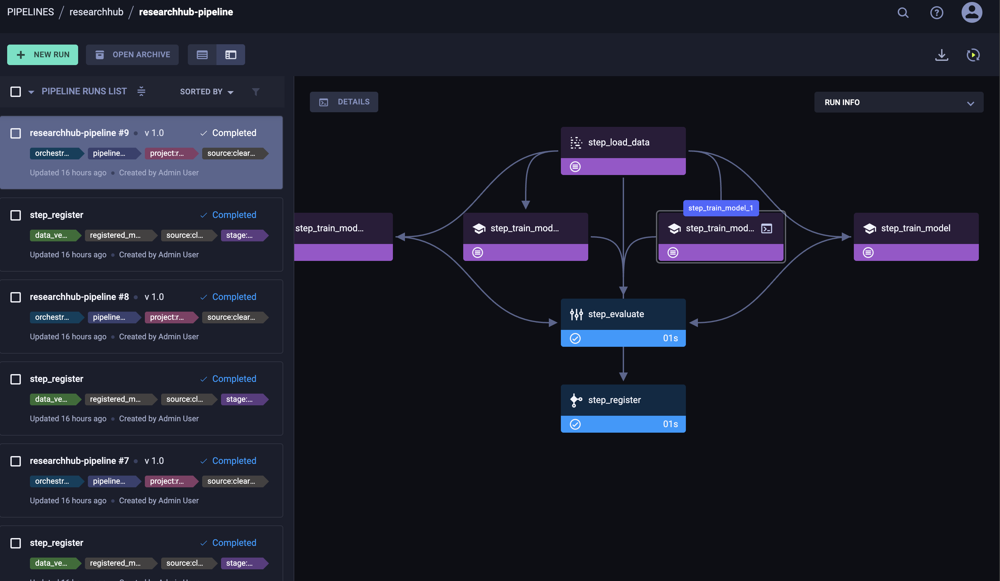
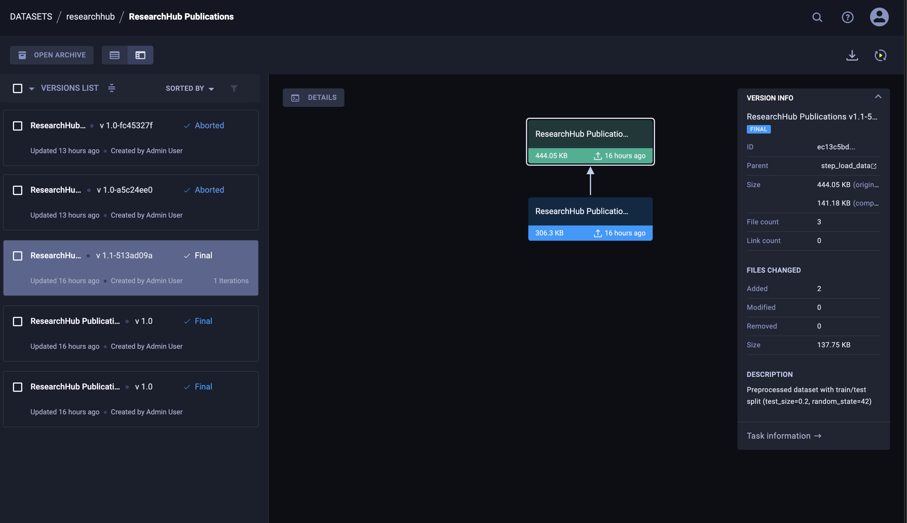

# Отчёт по ДЗ 5: ClearML для MLOps

## 🚀 Быстрая проверка

```bash
# 1) Клонируем и устанавливаем зависимости
git clone <your-repo>
cd research_agets_hub
poetry install

# 2) Запускаем ClearML Server
make clearml-server-up
# Ожидаем 1-2 минуты пока все сервисы станут healthy

# 3) Проверяем статус
make clearml-status
# Должно быть 6 контейнеров: apiserver, webserver, fileserver, elastic, mongo, redis

# 4) Настраиваем credentials
# Открываем http://localhost:8090
# Login: admin / admin
# Settings → Workspace → Create new credentials
# Копируем ключи и запускаем:
poetry run clearml-init
# Вводим:
# - API Host: http://localhost:8008
# - Web Host: http://localhost:8090
# - Files Host: http://localhost:8091
# - Access Key: (из UI)
# - Secret Key: (из UI)

# 5) Запускаем полный пайплайн (DVC + ClearML)
make pipeline
# или
poetry run dvc repro --force
# или
dvc repro --force

# 6) Проверяем результаты в UI
# http://localhost:8090 → Projects → researchhub
# - DATASETS: ArXiv Raw Publications, ResearchHub Publications
# - EXPERIMENTS: train_RandomForestClassifier, train_SVM, train_LogisticRegression
# - MODELS: зарегистрированные модели

# 7) Остановка
make clearml-server-down
```


---

## 📊 1. Настройка ClearML

### 1.1 Установка и настройка ClearML Server

**Файл конфигурации:** `docker-compose.yml` (объединен с MLflow и другими сервисами)

ClearML Server развернут через Docker Compose с минимальной конфигурацией:

| Сервис | Порт | Описание | Memory Limit |
|--------|------|----------|--------------|
| apiserver | 8008 | REST API для SDK | 512MB |
| webserver | 8090 | Web UI | 256MB |
| fileserver | 8091 | Хранилище артефактов | 256MB |
| elasticsearch | - | Индексирование | 768MB |
| mongo | - | База данных | 1GB |
| redis | - | Кэш и очереди | 512MB |

**Команды управления:**
```bash
make clearml-server-up    # Запуск
make clearml-status       # Проверка статуса
make clearml-server-down  # Остановка
```

### 1.2 База данных и хранилище

**Volumes (persistent storage):**
- `clearml-elastic` - данные Elasticsearch
- `clearml-mongo` - данные MongoDB
- `clearml-redis` - данные Redis
- `clearml-fileserver` - артефакты, модели, логи

**Все данные сохраняются между перезапусками** благодаря Docker volumes.

### 1.3 Создание проекта

Проект создается автоматически при первом запуске:

**В train_model.py:**
```python
task = Task.init(
    project_name="researchhub",
    task_name=f"train_{config.train.algorithm}",
    task_type=Task.TaskTypes.training,
)
```


### 1.4 Аутентификация

**Fixed Users Mode** (в docker-compose.yml):
```yaml
CLEARML__apiserver__auth__fixed_users__enabled: "true"
CLEARML__apiserver__auth__fixed_users__users: '[{"username": "admin", "password": "admin"}]'
```

**Получение API credentials:**
1. Открыть http://localhost:8090
2. Login: `admin` / `admin`
3. Settings → Workspace → Create new credentials
4. Скопировать Access Key и Secret Key
5. Запустить `poetry run clearml-init`

**Файл конфигурации:** `~/clearml.conf` (создается автоматически)

---

## 📈 2. Трекинг экспериментов

### 2.1 Автоматическое логирование

**Интеграция в существующие скрипты:**

#### fetch_arxiv_data.py
```python
# Автоматическая загрузка сырых данных в ClearML Dataset
dataset = Dataset.create(
    dataset_name="ArXiv Raw Publications",
    dataset_project="researchhub",
    dataset_version=f"1.0-{data_hash[:8]}",
)
dataset.add_files(path=csv_path)
dataset.upload()
dataset.finalize()
```

#### preprocess_data.py
```python
# Создание версии обработанных данных с метаданными
dataset = Dataset.create(
    dataset_name="ResearchHub Publications",
    dataset_project="researchhub",
    dataset_version=f"1.0-{data_hash[:8]}",
    parent_datasets=[parent_dataset],  # Связь с сырыми данными
)
# Логирование preview, гистограмм, статистики
```

#### train_model.py
```python
# Автоматическое логирование через ClearML SDK
task = Task.init(
    project_name="researchhub",
    task_name=f"train_{algorithm}",
    auto_connect_frameworks=True,  # Автологирование sklearn, pandas
)
# Логирование метрик, confusion matrix, feature importance
```

**Автоматически логируется:**
- Параметры модели (через `Task.connect()`)
- Метрики (через `logger.report_scalar()`)
- Артефакты (модели, метрики, метаданные)
- Git commit, branch, dirty status
- Версии библиотек (requirements)
- Системная информация




### 2.2 Система сравнения экспериментов

**В Web UI (http://localhost:8090):**

1. **Projects → researchhub → Experiments**
   - Список всех training tasks
   - Фильтрация по тегам, алгоритму, метрикам

2. **Compare experiments:**
   - Выбрать несколько tasks (например, все модели)
   - Кнопка "Compare" → таблица с метриками
   - Parallel Coordinates для анализа гиперпараметров

3. **Scalars tab:**
   - Графики accuracy, f1_score (train vs test)
   - Overfitting check (train-test-gap)
   - Cross-validation scores




### 2.3 Логирование метрик и параметров

**В train_model.py логируются:**

**Метрики:**
- `accuracy/train` - точность на train
- `accuracy/test` - точность на test
- `f1_score/train`, `f1_score/test`
- `precision/test`, `recall/test`
- `overfitting/train-test-gap` - проверка переобучения
- `Cross Validation/Mean Score`, `Cross Validation/Std Score`

**Параметры:**
- Все гиперпараметры модели (через `task.connect()`)
- Параметры предобработки (feature engineering)
- Dataset statistics (train/test samples, features, classes)

**Теги:**
- `stage:training`
- `model:RandomForestClassifier` / `model:SVM` / `model:LogisticRegression`
- `source:train_model.py`
- `test_accuracy:0.450`
- `mlflow_experiment:<name>`

### 2.4 Дашборды для анализа

**Встроенные дашборды ClearML UI:**





---

## 🤖 3. Управление моделями

### 3.1 Регистрация и версионирование моделей

**В train_model.py:**
```python
from clearml import OutputModel

output_model = OutputModel(
    task=task,
    framework="scikit-learn",
    name=f"{algorithm}_model",
)

# Загрузка весов
output_model.update_weights(
    weights_filename=model_output,
    auto_delete_file=False,
)

# Добавление метаданных
output_model.update_design(
    config_dict={
        "test_accuracy": test_metrics.get("accuracy", 0),
        "test_f1_score": test_metrics.get("f1_score", 0),
        "cv_mean": float(cv_scores.mean()),
        "training_samples": int(X_train.shape[0]),
        # ... другие метаданные
    }
)

# Публикация
output_model.publish()
```

**Каждый запуск создает новую версию модели** с уникальным ID.


### 3.2 Система метаданных для моделей

**Автоматически сохраняются:**
- Алгоритм (algorithm)
- Метрики производительности (accuracy, F1, precision, recall)
- Cross-validation scores (mean, std)
- Гиперпараметры модели
- Dataset информация (samples, features, classes)
- Training date
- MLflow run ID (для связи с MLflow)
- Data version (hash или tag)

**Доступ через:**
- Task parameters (конфигурация)
- Model metadata (через `update_design()`)
- Артефакты (metrics.json, metadata.yaml)

### 3.3 Автоматическое создание версий

**Каждый запуск `train_model.py` создает:**
- Новый ClearML Task (с уникальным ID)
- Новую версию модели в Model Registry
- Версионированные артефакты

**История версий:**
- Все версии доступны в UI (MODELS tab)
- Можно сравнить производительность разных версий
- Легко откатиться к предыдущей версии

### 3.4 Система сравнения моделей

**В UI:**
1. **MODELS tab** → Выбрать несколько моделей → Compare
2. **EXPERIMENTS tab** → Выбрать tasks → Compare

**Сравниваются:**
- Метрики (accuracy, F1, precision, recall)
- Гиперпараметры
- Dataset версии
- Training time

**Автоматическое сравнение в коде:**
- Все метрики логируются с одинаковыми именами
- Можно фильтровать по тегам (`model:RandomForestClassifier`)
- Сортировать по `test_accuracy` тегу





---

## ⚙️ 4. Пайплайны

### 4.1 ClearML Pipeline для ML Workflow

**Два варианта пайплайна:**

#### Вариант 1: Запуск с DVC  

**Файл:** `dvc.yaml`

**Каждый этап автоматически:**
- Логирует в ClearML Dataset (fetch, preprocess)
- Создает ClearML Task (train)
- Сохраняет результаты в DVC и MLflow

**Запуск:**
```bash
make pipeline        # или dvc repro --force
```

#### Вариант 2: Только ClearML

**Файл:** `scripts/clearml_pipeline_simple.py`

**Структура DAG (7 шагов):**
```
step_load_data (загрузка из ClearML Dataset или локально)
      ↓
┌─────┴─────┬─────────┬─────────┐
↓           ↓         ↓         ↓
train_      train_    train_    train_
LogisticReg RandomFor GradientB SVC
└─────┬─────┴─────────┴─────────┘
      ↓
step_evaluate (сравнение и выбор лучшей)
      ↓
step_register (регистрация в Model Registry)
```
- Есть сравнение моделей, но нет логирования в DVC\MLflow
**Запуск:**
```bash
make clearml-pipeline
```


### 4.2 Автоматический запуск пайплайнов

**DVC Pipeline:**
- Запускается через `make pipeline` или `dvc repro --force`
- Автоматически выполняется при изменении зависимостей
- Поддерживает параллельное выполнение (train stages)

**ClearML Pipeline:**
- Запускается через `make clearml-pipeline`
- Для production можно добавить ClearML Agent:
  ```bash
  docker-compose --profile with-agent up clearml-agent
  ```
- Тогда pipeline будет выполняться в очереди на agent

### 4.3 Система мониторинга выполнения

**В ClearML UI:**

1. **EXPERIMENTS tab:**
   - Список всех tasks с статусом (Running / Completed / Failed)
   - Фильтрация по статусу, тегам, дате
   - Console logs в реальном времени

2. **PIPELINES tab** (для clearml_pipeline_simple.py):
   - Визуальный DAG с состоянием каждого шага
   - Время выполнения каждого шага
   - Зависимости между шагами

3. **Console output:**
   - Логи каждого скрипта
   - Print statements видны сразу
   - Ошибки и warnings выделены


---

## 📁 Структура файлов

```
research_agets_hub/
├── docker-compose.yml            # Docker инфраструктура (MLflow + ClearML)
├── dvc.yaml                       # DVC pipeline (fetch → preprocess → train)
├── params.yaml                    # Параметры для всех этапов
├── Makefile                       # Команды управления
│
├── scripts/
│   ├── fetch_arxiv_data.py       # Загрузка данных + ClearML Dataset
│   ├── preprocess_data.py        # Предобработка + ClearML Dataset версия
│   ├── train_model.py            # Обучение + ClearML Task + Model Registry
│   ├── clearml_pipeline_simple.py # ClearML Pipeline (7 шагов, альтернатива)
│   └── upload_dataset.py         # Утилита для ручной загрузки датасета
│
├── researchhub/
│   └── pipeline_config_simple.py # Pydantic конфигурация для pipeline
│
└── config/
    └── pipeline_config.py        # Pydantic конфигурация (для train_model.py)
```

---

### Связь версий

- Каждая версия имеет **parent dataset** (кроме первой)
- Видна полная цепочка трансформаций данных
- Легко откатиться к любой версии
- Воспроизводимость гарантирована


---

## 🎯 Основные команды

```bash
# Управление ClearML Server
make clearml-server-up      # Запуск
make clearml-status         # Проверка статуса
make clearml-server-down    # Остановка
make clearml-init           # Настройка credentials

# Полный пайплайн (DVC + ClearML)
make pipeline               

# Отдельные этапы
make fetch-data             # fetch_arxiv_data.py (с ClearML Dataset)
make preprocess             # preprocess_data.py (с ClearML Dataset)
make train                  # train_rf (с ClearML tracking)
make train-all              # train_rf + train_svm + train_lr

# ClearML Pipeline (альтернативный со сравнением модлей)
make clearml-pipeline       

# Данные
make clearml-data-pipeline  # fetch → preprocess → upload в ClearML
make clearml-upload-dataset # Ручная загрузка датасета

# Очистка
make clearml-clean          # Удалить все данные ClearML (ВНИМАНИЕ!)
```

---
