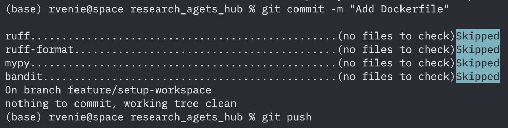

## Введение
Рабочее место Data Scientist настроено по актуальным стандартам: Cookiecutter, Poetry, Docker, линтеры и pre-commit.

## Структура проекта
Сгенерировано с помощью:
```
pip install cookiecutter-data-science
ccds
```
В корне репозитория находятся: `Dockerfile`, Makefile и все основные папки проекта.

## Инструменты и их настройка
- **Poetry** — менеджер зависимостей и виртуального окружения. Используется для установки и фиксации зависимостей, а также экспорта `requirements.txt` для Docker.
- **Pre-commit** — автоматическая проверка качества кода при каждом коммите.
- **Ruff** — линтер и авто-форматтер Python-кода, заменяет Black и Isort.
- **MyPy** — статический анализ типов, повышает стабильность кода.
- **Bandit** — анализ на уязвимости и безопасность.
- **Docker** — контейнеризация проекта для быстрой передачи и запуска на другой машине.
- **Makefile** — для удобства командной автоматизации (запуск тестов, линтинга и build).

Конфигурация инструментов хранится в файлах `.pre-commit-config.yaml`, `pyproject.toml`, `Dockerfile`.

## Управление зависимостями
Использовал Poetry:
```
poetry init --name research-agets-hub -n
poetry add pandas numpy scikit-learn
poetry add --group dev ruff mypy bandit pre-commit
poetry self add poetry-plugin-export
poetry export -f requirements.txt --output requirements.txt --without-hashes
```

## Развертывание и запуск проекта

**Шаги:**
1. Клонировать репозиторий:
    ```
    git clone <адрес_репозитория>
    cd research_agets_hub
    ```
2. Установить Poetry, зависимости и активировать среду:
    ```
    pip install poetry
    poetry install
    ```
3. Инициализировать pre-commit-хуки:
    ```
    poetry run pre-commit install
    ```
4. Запуск проверки кода вручную:
    ```
    poetry run pre-commit run --all-files
    ```
5. Использование Makefile (если добавлен):
    ```
    make lint   # Проверить стиль кода
    make test   # Запуск тестов, если они добавлены
    ```

**Docker:**
```
docker build -t research-agets-hub .
docker run --rm research-agets-hub
```

## Проверка качества кода
Инициализация pre-commit хуков:
```
poetry run pre-commit install
poetry run pre-commit run --all-files
```
Результат (все проверки прошли):


## Git workflow (ветвление)
- **main** — стабильная версия проекта.
- **feature/** — ветки для новых функций или экспериментов.
- Все фичи вливаются в main после проверки линтеров и успешного тестирования через pull-request.

Пример:
```
git checkout -b feature/название-фичи
# разработка
git add . && git commit -m "Feature: краткое описание"
git checkout main 
git merge feature/название-фичи
```
