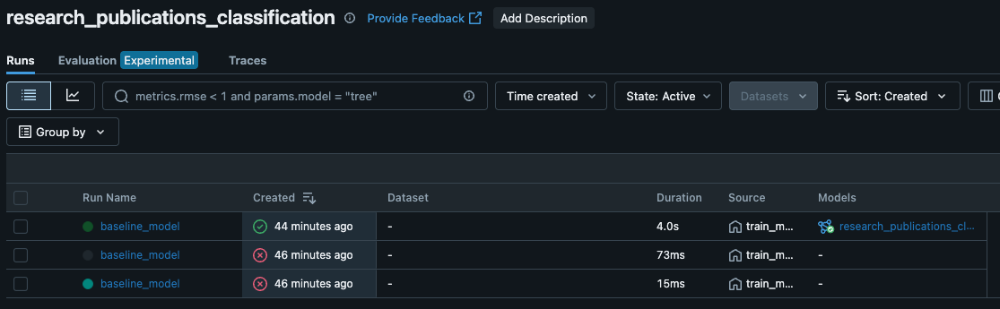
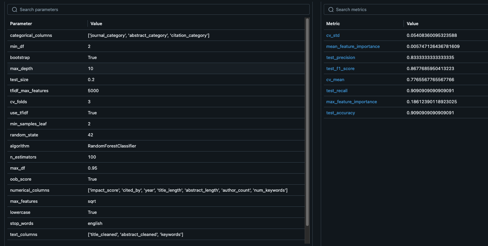
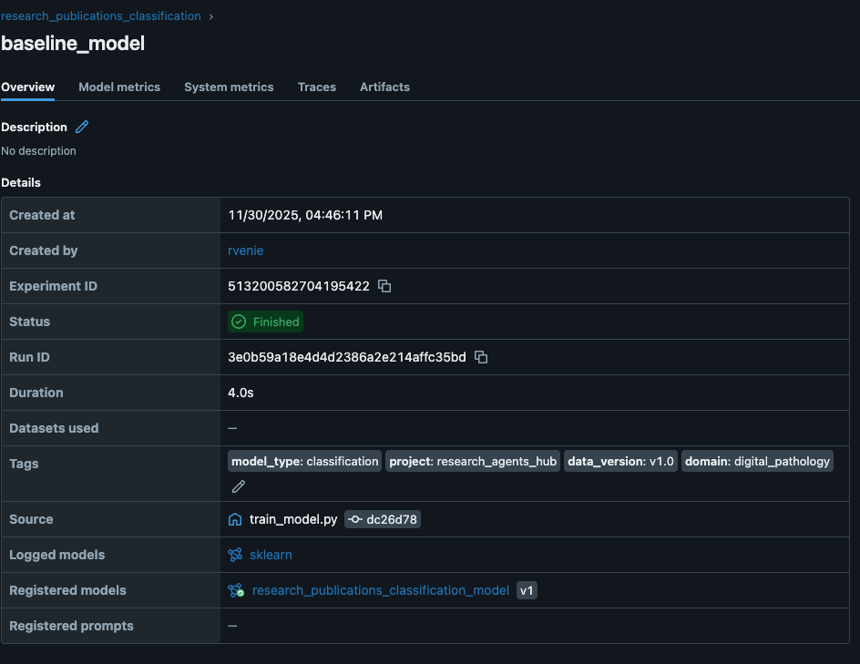
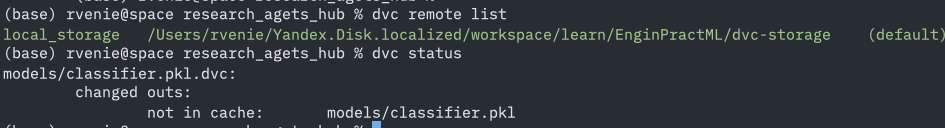
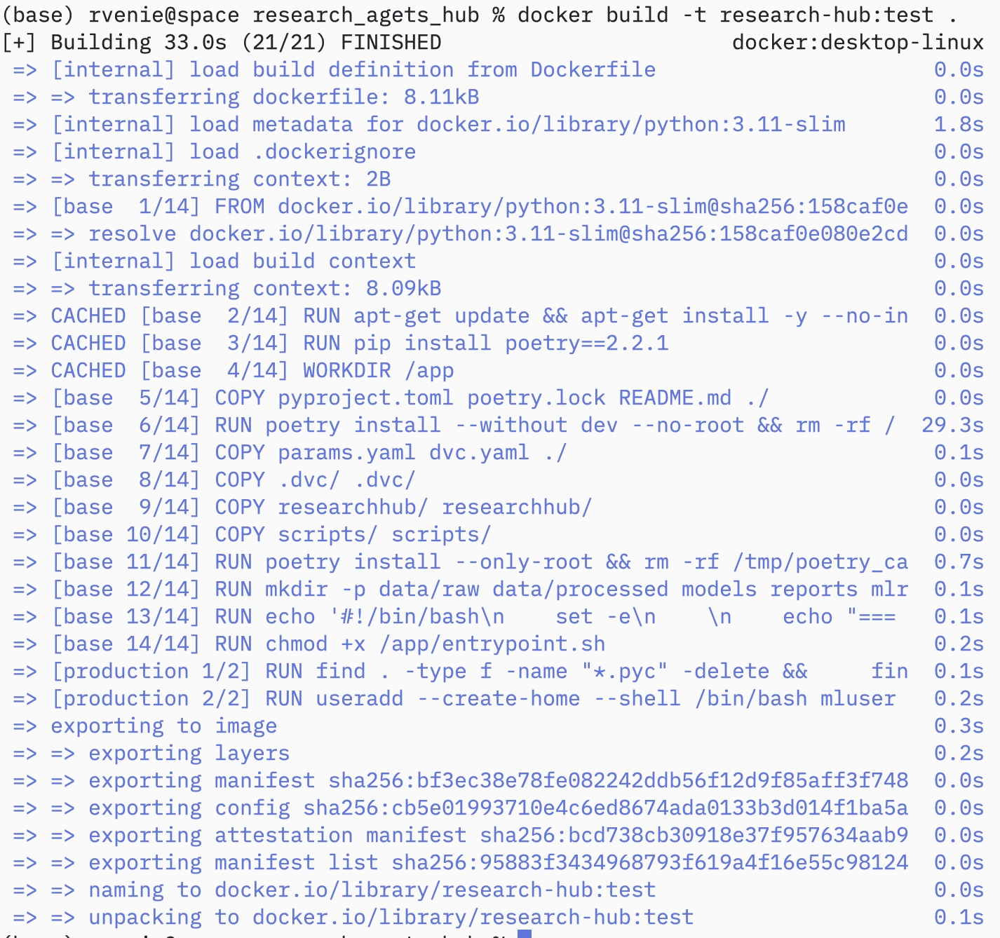
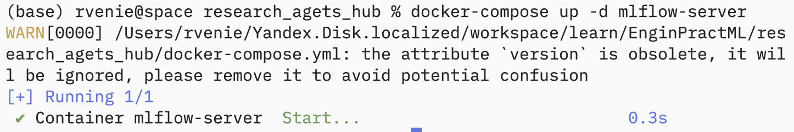

## Введение
Настроена комплексная система версионирования данных и моделей для ML проекта с использованием DVC и MLflow. Реализован полный цикл: от версионирования датасетов до отслеживания экспериментов и регистрации моделей.

## Выбранные инструменты

### Версионирование данных: DVC (Data Version Control)
**Обоснование выбора:**
- Git-подобный интерфейс для работы с большими файлами
- Поддержка различных типов remote storage (локальное, S3, GCS)
- Интеграция с существующим Git workflow
- Возможность создания воспроизводимых ML пайплайнов

### Версионирование моделей: MLflow
**Обоснование выбора:**
- Комплексное решение для ML lifecycle management
- Model Registry для управления версиями моделей
- Веб-интерфейс для анализа экспериментов
- Автоматическое логирование параметров, метрик и артефактов

## Настройка DVC для версионирования данных

### Инициализация DVC
```bash
# Инициализация DVC в проекте
dvc init

# Настройка локального remote storage для воспроизводимости
dvc remote add -d local_storage ../dvc_storage

# Включение автоматического добавления .dvc файлов в Git
dvc config core.autostage true
```

### Подготовка данных
Создан автоматический pipeline для получения данных ArXiv:
```bash
# Автоматическое получение данных ArXiv
python scripts/fetch_arxiv_data.py --query "cat:eess.IV OR cat:cs.CV OR cat:q-bio.QM" --max-results 100

# Результат: созданы файлы
# data/raw/arxiv_publications.csv
# data/raw/arxiv_metadata.yaml
```

### Версионирование данных с помощью DVC
```bash
# Добавление исходных данных в DVC
dvc add data/raw/arxiv_publications.csv
dvc add data/raw/arxiv_metadata.yaml

# Результат: созданы .dvc файлы для отслеживания
# data/raw/arxiv_publications.csv.dvc
# data/raw/arxiv_metadata.yaml.dvc
```

### Предобработка данных
Создан скрипт `scripts/preprocess_data.py` со следующими функциями:
- Очистка и нормализация текстовых данных
- Извлечение дополнительных признаков (количество авторов, длина текста)
- Категоризация по ArXiv категориям
- Обработка метаданных публикаций

```bash
# Запуск предобработки
python scripts/preprocess_data.py --input data/raw/arxiv_publications.csv --output data/processed/publications_processed.csv

# Результат: обработанный датасет с извлеченными признаками
```

### Версионирование обработанных данных
```bash
# Добавление обработанных данных в DVC
dvc add data/processed/publications_processed.csv
dvc add data/processed/processing_metadata.yaml

# Проверка статуса DVC
dvc status
# Data and pipelines are up to date.
```

## Настройка MLflow для версионирования моделей

### Конфигурация MLflow
В файле `params.yaml` настроены параметры эксперимента:
```yaml
mlflow:
  experiment_name: "arxiv_publications_classification"
  run_name: "baseline_model"
  tracking_uri: "file:./mlruns"
  tags:
    project: "research_agents_hub"
    data_source: "arxiv"
    model_type: "classification"
    data_version: "v2.0"
```

### Запуск MLflow сервера
```bash
# Запуск tracking server
nohup mlflow server --host 127.0.0.1 --port 3000 --backend-store-uri file:./mlruns > mlflow.log 2>&1 &

# Проверка доступности
curl http://127.0.0.1:3000/
# <!doctype html><html lang="en"><head><meta charset="utf-8"/>...
```

### Обучение модели с MLflow логированием
Создан скрипт `scripts/train_model.py` с полной интеграцией MLflow:

```bash
# Обучение модели
python scripts/train_model.py \
    --input data/processed/publications_processed.csv \
    --model-output models/classifier.pkl \
    --metrics metrics.json

# Результаты обучения логируются в MLflow автоматически
# Модель регистрируется в Model Registry
```

### Версионирование обученной модели
```bash
# Добавление модели в DVC
dvc add models/classifier.pkl

# Результат: создан models/classifier.pkl.dvc для отслеживания
```

## Результаты работы системы версионирования

### MLflow Model Registry
- **Зарегистрированная модель:** arxiv_publications_classification_model
- **Источник данных:** ArXiv API
- **Автоматическое логирование:** параметры, метрики, артефакты

### Логированные параметры:
- algorithm: RandomForestClassifier
- n_estimators: 100
- max_depth: 10
- test_size: 0.2
- tfidf_max_features: 5000
- random_state: 42

### Логированные метрики:
- Cross-validation accuracy
- Test accuracy, precision, recall, F1-score
- Feature importance

### Структура версионированных данных и моделей
```
data/
├── raw/
│   ├── arxiv_publications.csv.dvc    # DVC отслеживает ArXiv данные
│   └── arxiv_metadata.yaml.dvc       # DVC отслеживает метаданные
└── processed/
    ├── publications_processed.csv.dvc # DVC отслеживает обработанные данные
    └── processing_metadata.yaml.dvc   # DVC отслеживает метаданные обработки

models/
├── classifier.pkl.dvc                 # DVC отслеживает обученную модель
└── classifier_metadata.yaml          # Метаданные модели

mlruns/                               # MLflow tracking данные
└── experiments/                      # Эксперименты и модели

../dvc_storage/                       # Локальное хранилище DVC
└── files/                           # Версионированные файлы
```





## Контейнеризация для воспроизводимости

### Docker настройка
Создан многоэтапный Dockerfile:
```dockerfile
# Базовая среда с Python и зависимостями
FROM python:3.11-slim as base
# Установка DVC, MLflow и ML зависимостей
RUN pip install dvc==3.64.0 mlflow==2.22.2
```

### Docker Compose для оркестрации
```yaml
services:
  mlflow-server:
    ports: ["3000:3000"]
    command: ["mlflow-server"]
    
  ml-app:
    depends_on: [mlflow-server]
    command: ["train"]
```

## Проверка воспроизводимости

### Локальный запуск
```bash
# Установка зависимостей через Poetry
poetry install

# Получение данных из DVC remote
dvc pull

# Автоматический запуск pipeline
dvc repro

# Или ручной запуск этапов
python scripts/fetch_arxiv_data.py --max-results 100
python scripts/preprocess_data.py --input data/raw/arxiv_publications.csv
python scripts/train_model.py --input data/processed/publications_processed.csv
```

### Docker запуск
```bash
# Сборка и запуск через Docker Compose
docker-compose up -d mlflow-server
docker-compose run --rm ml-app train
dvc status
# Результат: модель обучена, метрики в MLflow UI
```

### Верификация результатов
```bash
# Проверка DVC статуса
dvc status
# Data and pipelines are up to date.

# Проверка конфигурации DVC
dvc remote list
# local_storage	../dvc_storage (default)
```



## Инструкция по воспроизводимости 

### Автоматический способ через DVC
```bash
# 1. Клонирование репозитория
git clone <repository_url>
cd research_agets_hub

# 2. Установка зависимостей
poetry install

# 3. Запуск MLflow сервера
nohup poetry run mlflow server --host 127.0.0.1 --port 3000 --backend-store-uri file:./mlruns > mlflow.log 2>&1 &

# 4. Запуск полного pipeline
poetry run dvc repro
```

### Пошаговая инструкция

#### Шаг 1: Подготовка окружения
```bash
# Установка Poetry (если не установлен)
curl -sSL https://install.python-poetry.org | python3 -

# Установка зависимостей
poetry install

# Проверка конфигурации DVC
poetry run dvc remote list
```

#### Шаг 2: Запуск сервисов
```bash
# Запуск MLflow сервера в фоне
nohup poetry run mlflow server --host 127.0.0.1 --port 3000 --backend-store-uri file:./mlruns > mlflow.log 2>&1 &

# Проверка статуса сервиса
curl -f http://localhost:3000/api/2.0/mlflow/experiments/search
```

#### Шаг 3: Выполнение pipeline
```bash
# Автоматический запуск всех этапов
poetry run dvc repro

# Или поэтапно:
# 1. Получение данных
poetry run dvc repro fetch_data

# 2. Предобработка
poetry run dvc repro preprocess

# 3. Обучение модели
poetry run dvc repro train
```

**Ожидаемый результат**: 
- Данные получены из ArXiv API и сохранены в `data/raw/`
- Данные обработаны и сохранены в `data/processed/`
- Модель обучена и зарегистрирована в MLflow
- Все артефакты версионированы в DVC

### Способ через Docker



```bash
# 1. Сборка образов
docker-compose build

# 2. Запуск сервисов
docker-compose up -d mlflow-server

# 3. Выполнение обучения
docker-compose run --rm ml-app train

# 4. Проверка результатов
open http://localhost:3000
```

## Git workflow для версионирования

### Структура веток
- **main** — стабильная версия с автоматизированным pipeline
- **feature/setup-workspace** — настройка рабочего окружения
- **feature/automated-pipeline** — текущая ветка с автоматизированной системой

### Коммиты версионирования
```bash
# Добавление DVC файлов и конфигурации
git add .dvc/config data/raw/*.dvc data/processed/*.dvc models/*.dvc dvc.yaml params.yaml

# Коммит изменений
git commit -m "feat: setup automated ArXiv data pipeline with DVC and MLflow"

# Синхронизация данных в DVC
dvc push
```
