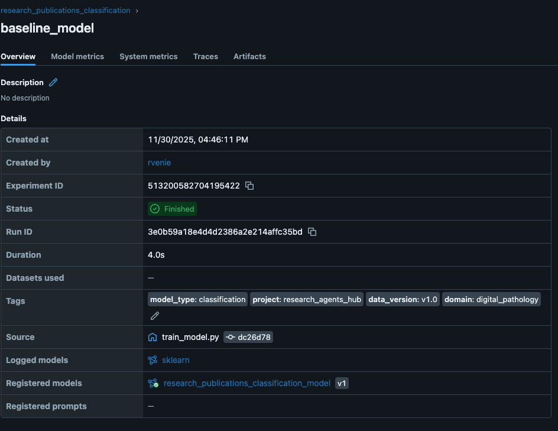

## Введение
Настроена комплексная система трекинга ML экспериментов с использованием MLflow. Реализована автоматизированная система проведения и анализа экспериментов с различными алгоритмами машинного обучения для классификации научных публикаций.

## 🚀 Быстрый старт

Самый быстрый способ запустить все эксперименты:

```bash
# 1. Клонируйте репозиторий
git clone <repository-url>
cd research_agets_hub

# 2. Установите зависимости
make install

# 3. Запустите MLflow UI (в отдельном терминале)
make mlflow-ui

# 4. Запустите все эксперименты
make experiments

# Или запустите полный пайплайн (загрузка данных + эксперименты)
make pipeline-full
```

Откройте http://127.0.0.1:5000 для просмотра результатов в MLflow UI.

## Выбранный инструмент: MLflow


## Настройка MLflow

### Установка и настройка
MLflow установлен через Poetry и настроен для локального использования:
```yaml
# В pyproject.toml
mlflow = "^2.22.2"
```

### Конфигурация в params.yaml
```yaml
mlflow:
  experiment_name: "research_publications_classification"
  run_name: "baseline_model"
  tracking_uri: "file:./mlruns"
  tags:
    project: "research_agents_hub"
    domain: "digital_pathology"
    model_type: "classification"
    data_version: "v1.0"
```

### Запуск tracking server
```bash
mlflow server --host 127.0.0.1 --port 5000 --backend-store-uri file:./mlruns
```

Tracking server доступен по адресу: http://127.0.0.1:5000

### Структура хранения
- **Backend Store**: Локальная файловая система (`./mlruns`)
- **Artifact Store**: Локальная директория для артефактов
- **Model Registry**: Встроенный SQLite для управления моделями

## Проведение экспериментов

### Автоматизированная система экспериментов
Создан скрипт `scripts/run_experiments.py` для автоматического проведения 17 экспериментов:

**Типы экспериментов:**
1. **Random Forest** (5 вариантов):
   - RF_baseline: базовые параметры
   - RF_more_trees: увеличенное количество деревьев (200)
   - RF_deeper: увеличенная глубина (max_depth=20)
   - RF_conservative: консервативные параметры
   - RF_more_features: расширенная матрица признаков (10k features, trigrams)

2. **Support Vector Machine** (5 вариантов):
   - SVM_baseline: RBF ядро, базовые параметры
   - SVM_linear: линейное ядро
   - SVM_high_C: высокая регуляризация (C=10.0)
   - SVM_low_C: низкая регуляризация (C=0.1)
   - SVM_poly: полиномиальное ядро

3. **Logistic Regression** (5 вариантов):
   - LR_baseline: L2 регуляризация
   - LR_l1_penalty: L1 регуляризация
   - LR_high_reg: высокая регуляризация (C=0.1)
   - LR_low_reg: низкая регуляризация (C=10.0)
   - LR_lbfgs: альтернативный солвер

4. **Feature Engineering** (2 варианта):
   - RF_unigrams_only: только униграммы
   - LR_extended_ngrams: расширенные n-граммы (до 4-грамм)

### Логирование параметров и метрик
Для каждого эксперимента автоматически логируются:

**Параметры:**
- Алгоритм и его гиперпараметры
- Размер тестовой выборки
- Random state для воспроизводимости
- Параметры предобработки признаков (TF-IDF, n-граммы)
- Количество фолдов кросс-валидации

**Метрики:**
- Cross-validation accuracy (mean и std)
- Test accuracy, precision, recall, F1-score
- Время выполнения эксперимента
- Важность признаков (для применимых алгоритмов)

**Артефакты:**
- Обученная модель (pickle)
- Метрики в JSON формате
- Метаданные модели в YAML
- TF-IDF векторизатор


### Система фильтрации и поиска
Реализованы утилиты для поиска и фильтрации экспериментов:

**Доступные функции:**
- `search_runs_by_metrics()` - поиск запусков по метрикам с пороговыми значениями
- `get_experiment_leaderboard()` - получение топ N лучших запусков по метрике
- Фильтрация в MLflow UI по параметрам и метрикам

## Интеграция с кодом

### Архитектура интеграции

Интеграция MLflow реализована на двух уровнях:

1. **Контекстный менеджер `mlflow_run_context`** - для управления экспериментами
   - Создает единый MLflow run для всего эксперимента
   - Автоматически логирует время выполнения и статус
   - Обрабатывает исключения и устанавливает теги

2. **Декораторы** - для автоматического логирования деталей функций
   - Применяются к вспомогательным функциям ВНУТРИ эксперимента
   - Логируют информацию о данных, время выполнения, ошибки
   - Используются во всех скриптах пайплайна (fetch, preprocess, train)

**Ключевой принцип:** Контекстный менеджер создает один run, декораторы обогащают его информацией.

### Контекстный менеджер для управления MLflow runs

- Автоматическое создание и завершение MLflow run
- Автоматическое логирование времени выполнения
- Установка статуса эксперимента (success/failed)
- Используется в `scripts/train_model.py` для обучения моделей

### Декораторы для автоматического логирования

Созданы **8 декораторов** в `researchhub/decorators.py`, **активно используются 3** во всех скриптах пайплайна

**1. @log_dataset_info** - автоматически логирует информацию о датасете:
   - Логирует размерность (shape, columns, rows)
   - Подсчитывает пропущенные значения
   - Собирает статистику по типам данных
   - Работает только с функциями, возвращающими `pd.DataFrame`

**2. @log_execution_time** - автоматически логирует время выполнения:
   - Измеряет время выполнения функции
   - Логирует метрику `{function_name}_execution_time` в MLflow
   - Работает с любыми функциями

**3. @handle_exceptions** - автоматически обрабатывает ошибки:
   - Перехватывает исключения
   - Логирует traceback в MLflow tags
   - Может пробросить исключение дальше (reraise=True)

**Использование декораторов в проекте:**

| Скрипт | Функция | Декораторы |
|--------|---------|-----------|
| `train_model.py` | `load_data` | `@handle_exceptions`, `@log_dataset_info` |
| `train_model.py` | `create_features` | `@handle_exceptions`, `@log_execution_time` |
| `train_model.py` | `evaluate_model` | `@log_execution_time`, `@handle_exceptions` |
| `preprocess_data.py` | `load_raw_data` | `@log_dataset_info`, `@handle_exceptions` |
| `preprocess_data.py` | `preprocess_data` | `@log_execution_time`, `@handle_exceptions` |
| `fetch_arxiv_data.py` | `save_to_csv` | `@log_execution_time`, `@handle_exceptions` |
| `fetch_arxiv_data.py` | `save_metadata` | `@log_execution_time`, `@handle_exceptions` |

**Итого:** 3 основных декоратора активно используются в 7 функциях по всему пайплайну.


Декораторы работают **прозрачно** - код функций остаётся чистым, а логирование происходит автоматически.

### Примеры использования контекстного менеджера

**Простой эксперимент:**
- Создается единый MLflow run для всего эксперимента
- Весь код внутри контекста автоматически отслеживается
- Модель, метрики и параметры логируются в один run

**Вложенные эксперименты (parent-child runs):**
- Родительский run для общего процесса (например, grid search)
- Дочерние runs для каждой итерации (каждая комбинация параметров)
- Параметр `nested=True` создает вложенную структуру

### Реализация контекстного менеджера

Контекстный менеджер `mlflow_run_context` находится в `researchhub/mlflow_utils.py` и автоматически:
- Создает и настраивает эксперимент
- Устанавливает теги
- Логирует время выполнения
- Обрабатывает исключения
- Устанавливает статус (success/failed)

**Использование в проекте:**
Функция `train_model()` в `scripts/train_model.py` оборачивает весь процесс обучения в `mlflow_run_context`, что создает единый MLflow run для всего эксперимента. Декорированные функции внутри контекста обогащают этот run дополнительной информацией.

### Утилиты для работы с экспериментами
Создан класс `MLflowExperimentManager` в `researchhub/mlflow_utils.py`:

**Основные возможности:**
- Создание и управление экспериментами
- Поиск и фильтрация запусков по метрикам
- Сравнение результатов экспериментов
- Экспорт результатов в различные форматы (CSV, JSON)
- Работа с Model Registry

**Функционал:**
- `get_best_run()` - поиск лучшего запуска по метрике
- `compare_runs()` - сравнение нескольких запусков
- `export_experiment_results()` - экспорт результатов

### Model Registry интеграция
Реализована автоматическая регистрация моделей:
- Регистрация модели по URI запуска
- Управление версиями моделей
- Переход между стадиями (Staging, Production, Archived)
- Теги и метаданные для моделей

## Воспроизводимость результатов

### Автоматизация через DVC и Makefile

Проект полностью интегрирован с DVC и Makefile для воспроизводимости экспериментов.

#### Через Makefile (рекомендуется)

```bash
# Установка зависимостей
make install

# Полный пайплайн: данные + обучение + все эксперименты
make pipeline-full

# Только эксперименты (если данные уже готовы)
make experiments

# Только обучение базовой модели
make train

# Запуск MLflow UI для просмотра результатов
make mlflow-ui

# Просмотр сводки результатов в терминале
make results

# Очистка артефактов экспериментов
make clean-experiments
```

#### Через DVC напрямую

```bash
# Полный пайплайн
poetry run dvc repro

# Только данные (fetch + preprocess)
poetry run dvc repro preprocess

# Только обучение базовой модели
poetry run dvc repro train

# Запуск всех экспериментов
poetry run dvc repro run_experiments

# Просмотр статуса пайплайна
poetry run dvc status

# Просмотр DAG пайплайна
poetry run dvc dag
```

#### Через Python скрипты напрямую

```bash
# Полное воспроизведение экспериментов
poetry run python scripts/run_experiments.py

# Запуск конкретного эксперимента
poetry run python scripts/train_model.py \
    --input data/processed/publications_processed.csv \
    --model-output models/classifier.pkl \
    --metrics metrics.json
```

### DVC Pipeline структура

```
fetch_data → preprocess → train (baseline)
                      ↓
                  run_experiments (15+ моделей)
```

**Стадии пайплайна:**

1. **fetch_data**: Загрузка данных из ArXiv API
   - Вход: параметры запроса
   - Выход: `data/raw/arxiv_publications.csv`
   - Декораторы: `@log_execution_time`, `@handle_exceptions` (2 функции)

2. **preprocess**: Предобработка данных
   - Вход: `data/raw/arxiv_publications.csv`
   - Выход: `data/processed/publications_processed.csv`
   - Декораторы: `@log_dataset_info`, `@log_execution_time`, `@handle_exceptions` (2 функции)

3. **train**: Обучение базовой модели
   - Вход: обработанные данные
   - Выход: `models/baseline_model.pkl`, метрики
   - Контекстный менеджер: `mlflow_run_context`
   - Декораторы: `@log_dataset_info`, `@log_execution_time`, `@handle_exceptions` (3 функции)
   - MLflow: автоматическое логирование параметров, метрик, модели

4. **run_experiments**: Запуск 15+ экспериментов
   - Вход: обработанные данные
   - Выход: `experiments/*/`, `experiments_summary.json`
   - Использует `train_model.py` для каждого эксперимента
   - MLflow: все результаты в `mlruns/`

### Фиксация random state
Все эксперименты используют `random_state=42` для обеспечения воспроизводимости результатов.

### Версионирование с DVC
Данные и модели версионируются с помощью DVC:
```bash
dvc add models/
dvc add data/processed/
git add models.dvc data/processed.dvc
```

## Веб-интерфейс MLflow

### Доступ к результатам
MLflow UI доступен по адресу: http://127.0.0.1:5000

**Основные возможности интерфейса:**
- Просмотр всех экспериментов и запусков
- Сравнение метрик между запусками
- Визуализация метрик и параметров
- Загрузка артефактов и моделей
- Управление Model Registry

### Фильтрация и поиск в UI
Примеры фильтров:
```
# Поиск по точности
metrics.test_accuracy >= 0.9

# Поиск по алгоритму
params.algorithm = "SVM"

# Поиск по времени выполнения
metrics.execution_time_seconds < 3.0

# Комбинированный поиск
metrics.test_accuracy >= 0.95 AND params.algorithm = "RandomForestClassifier"
```

## Структура проекта после настройки

```
research_agets_hub/
├── mlruns/                          # MLflow tracking данные
│   ├── 317899650776771811/         # ID эксперимента
│   └── models/                     # Model Registry
├── experiments/                    # Результаты экспериментов
│   ├── RF_baseline/
│   │   ├── model.pkl
│   │   ├── metrics.json
│   │   └── model_metadata.yaml
│   ├── SVM_linear/
│   └── ...
├── scripts/
│   ├── fetch_arxiv_data.py       # Загрузка данных (✅ декораторы)
│   ├── preprocess_data.py        # Предобработка (✅ декораторы)
│   ├── train_model.py            # Обучение (✅ декораторы + контекстный менеджер)
│   └── run_experiments.py        # Автоматизация экспериментов
├── researchhub/
│   ├── mlflow_utils.py           # Утилиты и контекстный менеджер
│   └── decorators.py             # 8 декораторов (3 активно используются)
├── experiments_summary.json       # Сводка результатов
└── params.yaml                   # Конфигурация экспериментов
```

## Инструкции для воспроизведения

### Вариант 1: Docker Compose 

**Шаг 1: Клонирование и подготовка**
```bash
git clone <repository-url>
cd research_agets_hub
```

**Шаг 2: Запуск полного пайплайна**
```bash
# Запуск MLflow сервера
docker-compose up mlflow-server -d

# Запуск полного пайплайна (загрузка данных + обучение + эксперименты)
docker-compose --profile training up model-training

# Альтернативно: запуск экспериментов напрямую
docker-compose run --rm ml-app python scripts/run_experiments.py
```

**Шаг 3: Просмотр результатов**
- MLflow UI: http://localhost:5000
- Результаты в папке `experiments/`
- Сводка: `experiments_summary.json`

### Вариант 2: Пошаговое выполнение

**Запуск отдельных этапов:**
```bash
# 1. Скачивание данных из ArXiv
docker-compose run --rm ml-app dvc repro fetch_data

# 2. Предобработка данных  
docker-compose run --rm ml-app dvc repro preprocess

# 3. Запуск экспериментов
docker-compose run --rm ml-app python scripts/run_experiments.py

# 4. Запуск MLflow сервера
docker-compose up mlflow-server
```

### Вариант 3: Локальная установка (без Docker)

**Подготовка окружения:**
```bash
# Установка Poetry (если не установлен)
curl -sSL https://install.python-poetry.org | python3 -

# Установка зависимостей
make install
# или
poetry install
```

**Запуск пайплайна через Makefile (самый простой способ):**

```bash
# Терминал 1: Запуск MLflow UI
make mlflow-ui

# Терминал 2: Запуск полного пайплайна с экспериментами
make pipeline-full
```

**Или пошагово:**

```bash
# 1. Загрузка и обработка данных
make data-pipeline
# или: poetry run dvc repro preprocess

# 2. Запуск MLflow сервера (в отдельном терминале)
make mlflow-server
# или: poetry run mlflow server --backend-store-uri file:./mlruns --port 5000 &

# 3. Запуск всех экспериментов
make experiments
# или: poetry run dvc repro run_experiments
# или: poetry run python scripts/run_experiments.py

# 4. Просмотр результатов
make results
```

**Доступные команды Makefile:**

| Команда | Описание |
|---------|----------|
| `make install` | Установить зависимости |
| `make pipeline` | Запустить полный DVC пайплайн |
| `make pipeline-full` | Запустить пайплайн с экспериментами |
| `make data-pipeline` | Загрузить и обработать данные |
| `make train` | Обучить базовую модель |
| `make experiments` | Запустить все эксперименты (15+) |
| `make mlflow-ui` | Запустить MLflow UI |
| `make mlflow-server` | Запустить MLflow server в фоне |
| `make results` | Показать сводку результатов |
| `make clean-experiments` | Удалить артефакты экспериментов |
| `make format` | Форматировать код |
| `make check` | Проверить качество кода |

### Проверка результатов

**Доступ к MLflow UI:**
- Веб-интерфейс: http://localhost:5000
- Все эксперименты отображаются с метриками и артефактами
- Возможность сравнения экспериментов


**Время выполнения:**
- Полный пайплайн: ~3-5 минут
- Только эксперименты: ~2-3 минуты
- Скачивание данных: ~30 секунд