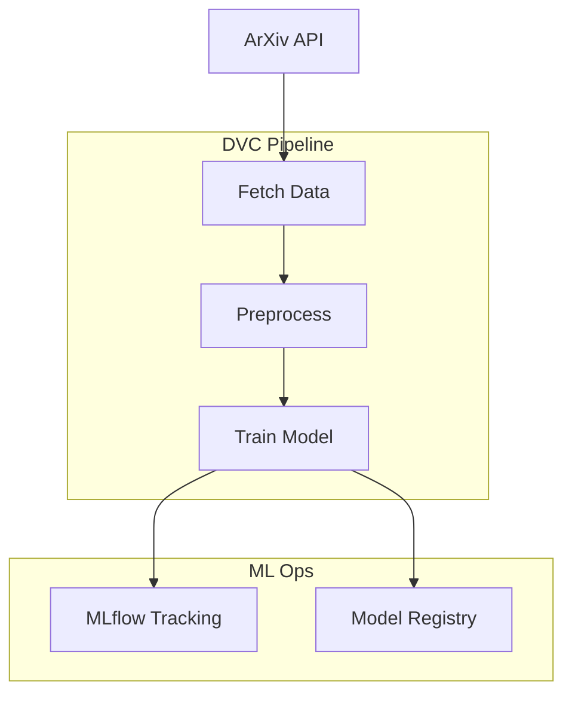

# ResearchHub Documentation

<div align="center">
  
  
  
  
</div>

## О проекте

**ResearchHub** — это мультиагентная система для автоматизации мониторинга и анализа научных публикаций в области цифровой патологии и анализа WSI (Whole Slide Imaging) данных.

Система работает как умный исследовательский ассистент, который непрерывно отслеживает новые разработки в области анализа гистопатологических изображений.

## Основные возможности

!!! success "Ключевые функции"

    - **Автоматический сбор данных** — получение публикаций из ArXiv API
    - **Версионирование данных** — полный контроль версий с помощью DVC
    - **Трекинг экспериментов** — MLflow и ClearML для отслеживания ML моделей
    - **Автоматизация пайплайнов** — DVC Pipelines + Pydantic конфигурации
    - **Воспроизводимость** — Docker контейнеризация всего окружения

## Архитектура



## Быстрый старт

=== "Poetry (рекомендуется)"

    ```bash
    # Клонирование репозитория
    git clone https://github.com/your-username/research-agets-hub.git
    cd research-agets-hub
    
    # Установка зависимостей
    poetry install
    
    # Запуск пайплайна
    poetry run dvc repro
    ```

=== "Docker"

    ```bash
    # Сборка образа
    docker-compose build
    
    # Запуск MLflow сервера
    docker-compose up -d mlflow-server
    
    # Запуск обучения
    docker-compose run --rm ml-app train
    ```

## Структура проекта

```
research_agets_hub/
├── researchhub/           # Исходный код
│   ├── decorators.py      # Декораторы для MLflow
│   ├── mlflow_utils.py    # Утилиты MLflow
│   ├── features.py        # Извлечение признаков
│   └── modeling/          # Модели ML
├── scripts/               # Скрипты для запуска
├── config/                # Конфигурации
├── data/                  # Данные (DVC tracked)
├── models/                # Обученные модели
├── experiments/           # Результаты экспериментов
└── clearml/               # ClearML интеграция
```

## Технологический стек

| Категория | Технология | Назначение |
|-----------|------------|------------|
| **ML Framework** | scikit-learn | Классические ML алгоритмы |
| **Эксперименты** | MLflow, ClearML | Трекинг и сравнение |
| **Данные** | DVC | Версионирование данных |
| **Оркестрация** | DVC Pipelines | Автоматизация пайплайнов |
| **Конфигурации** | Pydantic | Валидация параметров |
| **Контейнеризация** | Docker | Воспроизводимость |
| **Качество кода** | Ruff, MyPy, Bandit | Линтинг и безопасность |

## Документация

<div class="grid cards" markdown>

-   :material-rocket-launch:{ .lg .middle } **Быстрый старт**

    ---

    Начните работу с проектом за 5 минут

    [:octicons-arrow-right-24: Перейти](getting-started/quickstart.md)

-   :material-book-open-variant:{ .lg .middle } **Руководство**

    ---

    Подробное руководство по использованию

    [:octicons-arrow-right-24: Перейти](user-guide/overview.md)

-   :material-api:{ .lg .middle } **API Reference**

    ---

    Документация API модулей

    [:octicons-arrow-right-24: Перейти](api/index.md)

-   :material-server:{ .lg .middle } **Развёртывание**

    ---

    Инструкции по деплою

    [:octicons-arrow-right-24: Перейти](deployment/docker.md)

</div>

## Ссылки

- [GitHub Repository](https://github.com/your-username/research-agets-hub)
- [MLflow UI](http://localhost:3000) (локально)
- [ClearML UI](http://localhost:8080) (локально)
