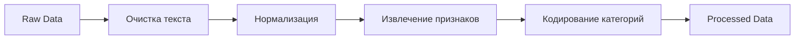

# Работа с данными

Руководство по загрузке, обработке и версионированию данных в ResearchHub.

## Источники данных

### ArXiv API

Основной источник — публикации из ArXiv в области:

- `cs.CV` — Computer Vision
- `eess.IV` — Image and Video Processing  
- `q-bio.QM` — Quantitative Methods in Biology
- `cs.LG` — Machine Learning

## Загрузка данных

### Через скрипт

```bash
poetry run python scripts/fetch_arxiv_data.py \
    --query "cat:eess.IV OR cat:cs.CV OR cat:q-bio.QM" \
    --max-results 100 \
    --output-dir data/raw
```

### Параметры запроса

| Параметр | Описание | Пример |
|----------|----------|--------|
| `--query` | Поисковый запрос | `cat:cs.CV` |
| `--max-results` | Макс. количество | `100` |
| `--output-dir` | Директория вывода | `data/raw` |
| `--start-date` | Начальная дата | `2024-01-01` |

### Через DVC

```bash
# Автоматический запуск через пайплайн
dvc repro fetch_data
```

## Структура данных

### Raw данные

```
data/raw/
├── arxiv_publications.csv      # Основные данные
├── arxiv_metadata.yaml         # Метаданные запроса
├── arxiv_publications.csv.dvc  # DVC tracking
└── arxiv_metadata.yaml.dvc
```

### Формат CSV

| Колонка | Тип | Описание |
|---------|-----|----------|
| `id` | string | ArXiv ID публикации |
| `title` | string | Название |
| `abstract` | string | Аннотация |
| `authors` | string | Список авторов |
| `categories` | string | Категории ArXiv |
| `published` | datetime | Дата публикации |
| `updated` | datetime | Дата обновления |

## Предобработка

### Запуск

```bash
poetry run python scripts/preprocess_data.py \
    --input data/raw/arxiv_publications.csv \
    --output data/processed/publications_processed.csv
```

### Этапы обработки



### Очистка текста

```python
def clean_text(text: str) -> str:
    """Очистка текста публикации."""
    # Удаление HTML тегов
    text = re.sub(r'<[^>]+>', '', text)
    # Удаление LaTeX
    text = re.sub(r'\$[^$]+\$', '', text)
    # Приведение к нижнему регистру
    text = text.lower()
    # Удаление спецсимволов
    text = re.sub(r'[^\w\s]', ' ', text)
    return text
```

### Извлечение признаков

```python
from sklearn.feature_extraction.text import TfidfVectorizer

vectorizer = TfidfVectorizer(
    max_features=5000,
    ngram_range=(1, 2),
    stop_words='english',
    min_df=2,
    max_df=0.95
)

X = vectorizer.fit_transform(texts)
```

## Версионирование с DVC

### Добавление файлов

```bash
# Добавление в DVC
dvc add data/raw/arxiv_publications.csv

# Коммит .dvc файла
git add data/raw/arxiv_publications.csv.dvc
git commit -m "Add ArXiv dataset v1"

# Загрузка в remote
dvc push
```

### Получение данных

```bash
# Получение всех версионированных файлов
dvc pull

# Получение конкретного файла
dvc pull data/raw/arxiv_publications.csv
```

### Переключение версий

```bash
# Просмотр истории
git log --oneline data/raw/arxiv_publications.csv.dvc

# Переключение на версию
git checkout abc123 data/raw/arxiv_publications.csv.dvc
dvc checkout
```

## Валидация данных

### Автоматическая проверка

```python
from pydantic import BaseModel, validator
from typing import List

class PublicationRecord(BaseModel):
    id: str
    title: str
    abstract: str
    categories: List[str]
    
    @validator('abstract')
    def abstract_not_empty(cls, v):
        if len(v.strip()) < 50:
            raise ValueError('Abstract too short')
        return v
```

### Статистика датасета

```bash
# Просмотр статистики
poetry run python -c "
import pandas as pd
df = pd.read_csv('data/processed/publications_processed.csv')
print(df.describe())
print(f'Записей: {len(df)}')
print(f'Категорий: {df.category.nunique()}')
"
```

## Результаты предобработки

После выполнения `preprocess`:

```
data/processed/
├── publications_processed.csv    # Обработанные данные
├── processing_metadata.yaml      # Метаданные обработки
├── vectorizer.pkl               # Сохранённый TF-IDF
└── label_encoder.pkl            # Кодировщик меток
```

### Метаданные обработки

```yaml
# processing_metadata.yaml
processing_date: "2024-12-26T10:30:00"
input_records: 100
output_records: 95
dropped_records: 5
features_count: 5000
categories:
  - cs.CV
  - eess.IV
  - q-bio.QM
```

## Советы и лучшие практики

!!! tip "Рекомендации"

    1. **Версионируйте все данные** — даже промежуточные
    2. **Документируйте изменения** — в commit сообщениях
    3. **Храните метаданные** — запрос, дата, параметры
    4. **Валидируйте входные данные** — до обработки

!!! warning "Осторожно"

    - ArXiv API имеет rate limiting — не делайте слишком много запросов
    - Большие датасеты лучше хранить в облачном remote (S3, GCS)

## Следующие шаги

- [Обучение моделей](training.md)
- [Эксперименты](experiments.md)
- [API Features](../api/features.md)
