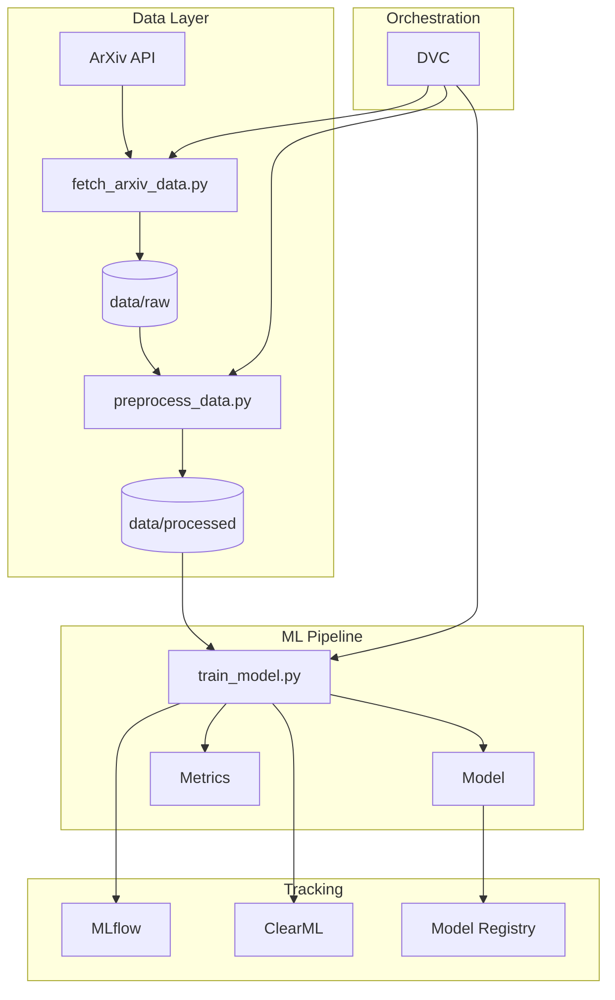

# Обзор

Полное руководство по использованию ResearchHub для анализа научных публикаций.

## Архитектура системы

ResearchHub построен по модульному принципу с чётким разделением ответственности:



## Основные компоненты

### 1. Сбор данных

Модуль для автоматического получения публикаций из ArXiv:

- Поддержка сложных запросов по категориям
- Автоматическое сохранение метаданных
- Версионирование через DVC

### 2. Предобработка

Обработка текстовых данных:

- Очистка и нормализация текста
- Извлечение признаков (TF-IDF)
- Категоризация публикаций

### 3. Обучение моделей

Поддерживаемые алгоритмы:

| Алгоритм | Описание | Параметры |
|----------|----------|-----------|
| **Random Forest** | Ансамбль деревьев | n_estimators, max_depth |
| **SVM** | Метод опорных векторов | kernel, C, gamma |
| **Logistic Regression** | Логистическая регрессия | C, penalty, solver |

### 4. Трекинг экспериментов

Два инструмента на выбор:

- **MLflow** — стандарт индустрии
- **ClearML** — продвинутые возможности

## Рабочий процесс

### Типичный workflow

```bash
# 1. Обновление данных
dvc repro fetch_data

# 2. Предобработка
dvc repro preprocess

# 3. Обучение с трекингом
dvc repro train

# 4. Анализ результатов
mlflow ui
```

### Использование декораторов

```python
from researchhub.decorators import mlflow_track

@mlflow_track(
    experiment_name="my_experiment",
    log_params=True,
    log_artifacts=True
)
def train_model(X, y, **params):
    model = RandomForestClassifier(**params)
    model.fit(X, y)
    return model
```

## Makefile команды

```bash
# Основные команды
make install      # Установка зависимостей
make setup        # Полная настройка
make pipeline     # Запуск DVC пайплайна
make train        # Только обучение

# Качество кода
make lint         # Проверка кода
make format       # Форматирование
make check        # Все проверки

# MLOps
make mlflow-ui    # Запуск MLflow UI
make clearml-server  # Запуск ClearML
```

## Следующие шаги

1. [Работа с данными](data.md) — загрузка и предобработка
2. [Обучение моделей](training.md) — настройка и запуск
3. [Эксперименты](experiments.md) — трекинг и сравнение
